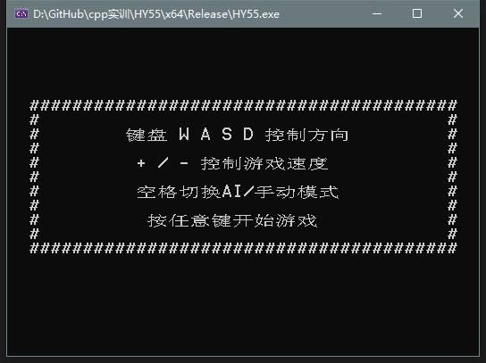

# GreedySnake

  *大一下程序设计实训*

---

## 序言

> 之前在网上看到了一张很火的贪吃蛇 GIF。当时由于没怎么接触算法只能喊666，既然学了一年的程序设计， 那么这次就来尝试写一个贪吃蛇AI吧
>>

## 总体概况

### 环境
- 开发环境：Visual Studio 2019
- 开发语言：C++ 和少许的Windows API
- 运行环境：Windows 10

### 下载使用

- 代码是使用Visual Studio 2019编译的。2019版本的可直接打开，其他版本则新建一个工程文件，把文件拖进去。

### 运行效果

### 已知问题

- 使用vector容器储存蛇身，导致后期容易莫名其妙卡住不动

- 查找路径时默认采用左右上下方向的优先级来找最短路，导致某种情况下蛇会一直吃不到食物而绕圈圈，如下

- 改进方向的话后期会写一个判断函数，如果一直绕圈圈走而吃不到食物则会改变方向的优先级。其实让蛇一直走S型路线的话是最容易吃到满屏的，不过这样就没意思了。

### 完善方向

- 把vector容器改成数组模拟，好处是代码运行速度会更快，不容易出错，坏处是编写复杂和数组容量会受限。

- 优化寻路算法，因为我在吃食物时走的是最短路，导致后期容易被自己绕死，解决办法还是得看开头的GIF图片，容易得知吃食物时最好绕弯走。这样就不能用BFS来走最短路和最远路了（因为我是使用的曼哈顿距离来判断最远路，实际上是要绕弯走才是最远）。后期决定使用A*来跑，不过代码会很复杂。

- 优化界面

### 主要代码介绍

